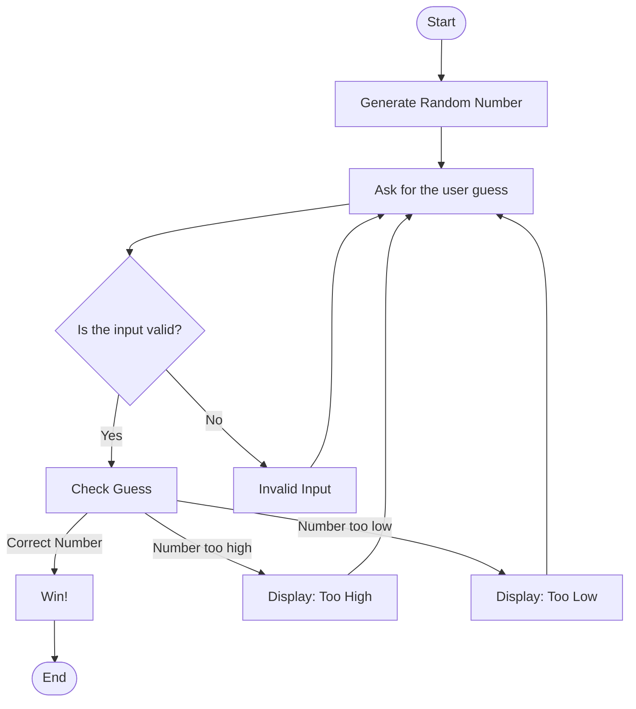

```mermaid
flowchart TD
A([Start]) --> B[Generate Random Number]
B --> C[Ask for the  user guess]
C --> D{Is the input valid?}
D --> |Yes| E[Check Guess]
D --> |No| F[Invalid Input]
F --> C
E --> |Correct Number| G[Win!]
E --> |Number too high| H[Display: Too High]
E --> |Number too low| I[Display: Too Low]
H --> C
I --> C
G --> J([End])
```
